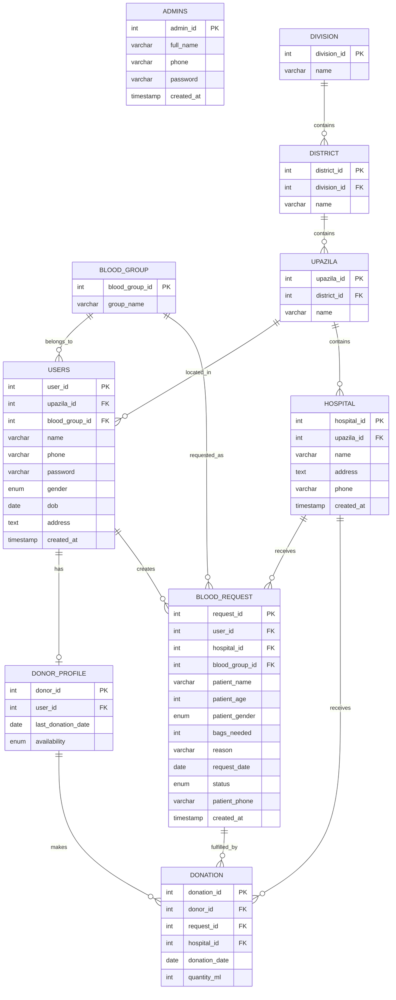

# Blood Donation Network

This is a **DBMS Lab course project** titled **"Blood Donation Network"**.

**Developed by:** Rakibul Islam Sifat  
**Student ID:** 242-15-353

## Project Overview

**Blood Donation Network** is a web-based blood donation management platform designed to connect blood donors with people who need blood.

The system allows users to:

- Register and log in
- Create a donor profile
- Select blood group and location
- Search for blood donors
- View donor availability
- Create blood requests
- Select a hospital for a blood request
- Manage blood request information
- Record blood donations
- Work with Bangladesh's Division → District → Upazila location hierarchy

The project is developed as an academic **DBMS Lab project** using PHP, MySQL, HTML, CSS, JavaScript, and Tailwind CSS.

---

## Technology Stack

| Technology | Purpose |
|---|---|
| HTML5 | Frontend structure |
| CSS3 | Styling |
| JavaScript | Frontend logic and API communication |
| Tailwind CSS | UI styling |
| PHP | Backend/API |
| MySQL / MariaDB | Database |
| PDO | Database connection and prepared statements |
| XAMPP | Local development environment |

---

# ER Diagram

The current database design can be represented as follows:



---

# DBMS Topics Used

This project applies several important DBMS concepts, including:

- Relational database design
- Entity-Relationship (ER) modeling
- Primary keys
- Foreign keys
- One-to-one relationships
- One-to-many relationships
- Normalization
- **1NF, 2NF and 3NF**
- Referential integrity
- Constraints
- SQL queries
- `SELECT`, `INSERT`, `UPDATE`, and `DELETE`
- `JOIN`
- `WHERE`
- `ORDER BY`
- Aggregate/query operations
- Transactions using:
  - `START TRANSACTION`
  - `COMMIT`
  - `ROLLBACK`
- Prepared statements using PDO
- CRUD operations
- Relational data hierarchy
- Database-backed authentication

---

# Database Tables

The current database contains the following tables:

```text
admins
blood_group
blood_request
district
division
donation
donor_profile
hospital
upazila
users
```

## 1. `users`

Stores registered user information.

Main fields:

```text
user_id
upazila_id
blood_group_id
name
phone
password
gender
dob
address
created_at
```

## 2. `admins`

Stores administrator information.

```text
admin_id
full_name
phone
password
created_at
```

## 3. `blood_group`

Stores available blood groups.

```text
blood_group_id
group_name
```

Examples:

```text
A+
A-
B+
B-
AB+
AB-
O+
O-
```

## 4. `division`

Stores Bangladesh divisions.

```text
division_id
name
```

## 5. `district`

Stores districts and their parent divisions.

```text
district_id
division_id
name
```

Relationship:

```text
Division
   ↓
District
```

## 6. `upazila`

Stores upazilas and their parent districts.

```text
upazila_id
district_id
name
```

Relationship:

```text
Division
   ↓
District
   ↓
Upazila
```

## 7. `donor_profile`

Stores donor-specific information.

```text
donor_id
user_id
last_donation_date
availability
```

Relationship:

```text
User
 ↓
Donor Profile
```

## 8. `hospital`

Stores hospitals/clinics where blood requests and donations can be associated.

```text
hospital_id
upazila_id
name
address
phone
created_at
```

The project includes hospital data for **Dhaka District**.

## 9. `blood_request`

Stores blood requests created by users.

```text
request_id
user_id
hospital_id
blood_group_id
patient_name
patient_age
patient_gender
bags_needed
reason
request_date
status
patient_phone
created_at
```

Relationship:

```text
User
 ↓
Blood Request
 ↓
Hospital
```

## 10. `donation`

Stores completed blood donation records.

```text
donation_id
donor_id
request_id
hospital_id
donation_date
quantity_ml
```

This connects:

```text
Donor
   ↓
Donation
   ↓
Blood Request
   ↓
Hospital
```

---

# Project Structure

A simplified project structure is:

```text
BloodDonation/
│
├── index.html
│
├── Users/
│   ├── signup.html
│   └── signin.html
│
├── backend/
│   └── Dashboard/
│       ├── dashboard.html
│       └── connector.php
│
├── style/
│   ├── style.css
│   └── Images/
│       └── logo.png
│
├── blood_bank_db.sql
│
└── README.md
```

The exact folder structure may vary depending on the version of the project.

---

# Requirements

To run this project locally, install:

- **XAMPP**
- **Apache**
- **MySQL / MariaDB**
- A modern web browser

Recommended browsers:

- Google Chrome
- Mozilla Firefox
- Microsoft Edge
- Brave
- Safari

---

# How to Run on Another PC

This project is designed to be easy to set up on another computer.

## Step 1 — Install XAMPP

Download and install XAMPP:

https://www.apachefriends.org/

After installation, open the XAMPP Control Panel.

Start:

```text
Apache
MySQL
```

Both services should show as running.

---

# Step 2 — Copy the Project

Copy the complete project folder into the XAMPP web directory.

### Windows

```text
C:\xampp\htdocs\BloodDonation
```

### macOS

```text
/Applications/XAMPP/xamppfiles/htdocs/BloodDonation
```

### Linux

Depending on the XAMPP installation:

```text
/opt/lampp/htdocs/BloodDonation
```

The final structure should look similar to:

```text
htdocs/
└── BloodDonation/
    ├── index.html
    ├── Users/
    ├── backend/
    ├── style/
    └── README.md
```

---

# Step 3 — Create the Database

Open:

```text
http://localhost/phpmyadmin/
```

Create a database named:

```text
blood_bank_db
```

Alternatively, run:

```sql
CREATE DATABASE blood_bank_db;
```

Then select:

```text
blood_bank_db
```

---

# Step 4 — Import the Database

Import the included SQL database file:

```text
blood_bank_db.sql
```

In phpMyAdmin:

```text
blood_bank_db
    ↓
Import
    ↓
Choose File
    ↓
blood_bank_db.sql
    ↓
Go
```

The SQL file creates the required tables and inserts the required database data.

After successful import, you should see tables such as:

```text
admins
blood_group
blood_request
district
division
donation
donor_profile
hospital
upazila
users
```

---

# Step 5 — Configure Database Connection

Open:

```text
backend/Dashboard/connector.php
```

Check the database configuration.

Typical local XAMPP configuration:

```php
$host = 'localhost';
$dbname = 'blood_bank_db';
$username = 'root';
$password = '';
```

For a default XAMPP installation:

```text
Host: localhost
Database: blood_bank_db
Username: root
Password: empty
```

If your MySQL installation uses a password, change the `$password` value accordingly.

---

# Step 6 — Open the Project

Open:

```text
http://localhost/BloodDonation/
```

You can also directly open:

```text
http://localhost/BloodDonation/Users/signup.html
```

or:

```text
http://localhost/BloodDonation/Users/signin.html
```

---

# Common Problems

## Apache does not start

Another application may already be using port `80` or `443`.

Check the XAMPP Apache logs and change the Apache port if necessary.

## MySQL does not start

Another MySQL/MariaDB service may already be using port `3306`.

Check:

```text
3306
```

and stop the conflicting database service if appropriate.

## Database connection error

Check:

```text
Database name
Username
Password
Host
MySQL service
```

The expected database name is:

```text
blood_bank_db
```

## 404 / Page Not Found

Make sure the project is actually inside:

```text
htdocs/BloodDonation/
```

Then use:

```text
http://localhost/BloodDonation/
```

Do not open the HTML files using `file://`.

---

# Open Source

This project is **fully open source** and is intended for learning, academic use, modification, and further development.

You are free to:

- Use the source code
- Study the implementation
- Modify the project
- Add new features
- Improve the database
- Change the UI
- Use the project as a learning reference
- Fork the project
- Share modified versions

If you redistribute a modified version, keeping the original project attribution is appreciated.

---

# Academic Purpose

This project was developed primarily for the **DBMS Lab course**.

The main objective is to demonstrate practical application of:

```text
ER Modeling
      ↓
Relational Database
      ↓
Normalization
      ↓
SQL
      ↓
PHP Backend
      ↓
Web Application
```

The project is suitable for demonstrating database concepts through a real-world blood donation use case.

---

# Important Note

This project is an **academic/open-source project** and should not be considered a production-grade medical or emergency blood-management system without additional security, validation, privacy, verification, and operational controls.

Hospital and healthcare information should be independently verified before being used for real-world medical decisions.

---

# License

This project is released as **open source**.

You may use, modify, study, and redistribute the project for educational and development purposes.

See the repository's license file if a specific open-source license is added later.

---

# Developer

**Rakibul Islam Sifat**

**Student ID:** `242-15-353`

**Project:** Blood Donation Network

**Course:** DBMS Lab
