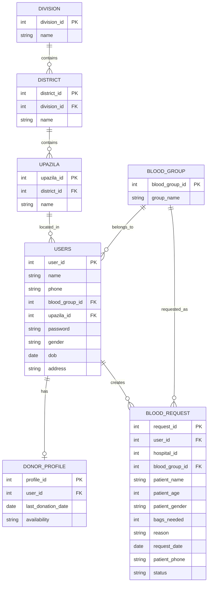

# Blood Donation Network

This is a DBMS Lab course project titled "Blood Donation Network".

Developed by: Rakibul Islam Sifat
Student ID: 242-15-353

## Project Overview
Blood Donation Network is a web-based platform that connects blood donors and people who need blood. The system allows users to register, log in, search donors by blood group and location, and create blood request posts.

## ER Diagram
The database design for this project can be represented as follows:

## DBMS Topics Used
This project applies several important DBMS concepts, including:

- Relational database design
- Entity-Relationship (ER) modeling
- Primary keys and foreign keys
- Normalization (1NF, 2NF, 3NF) to reduce redundancy and improve data consistency
- Joins to combine data from multiple related tables
- Constraints and data integrity rules
- Transactions using BEGIN, COMMIT, and ROLLBACK
- CRUD operations (Create, Read, Update, Delete)
- Prepared statements for secure SQL execution

## Database Tables Used
The project uses tables such as:

- users
- donor_profile
- blood_group
- division
- district
- upazila
- blood_request

These tables are connected through relationships to support donor search and blood request management.

## How to Get and Run This Project
If you want to use this project locally, follow these steps:

1. Install XAMPP / WAMP on your computer.
2. Make sure Apache and MySQL are running.
3. Download or clone this project into your web server folder:
   - XAMPP: C:\xampp\htdocs\BloodDonation
   - macOS XAMPP: /Applications/XAMPP/xamppfiles/htdocs/BloodDonation
4. Create a MySQL database named `blood_bank_db`.
5. Create the required tables and insert sample data according to the project schema.
6. Open the PHP connector file and verify the database credentials if needed.
7. Open your browser and visit:
   - http://localhost/BloodDonation/

## Notes
- This project is designed mainly for academic DBMS lab learning.
- If you face any database connection issue, check your XAMPP MySQL service and the database username/password in the PHP connection file.

## Contact
Developed by: Rakibul Islam Sifat
Student ID: 242-15-353
